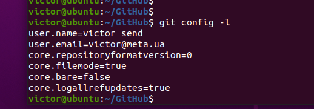
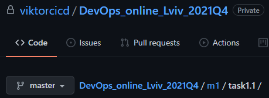
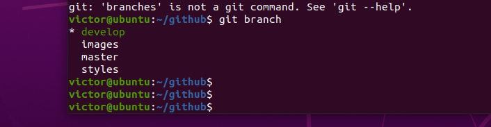

## Module 1 DevOps Introduction

### TASK 1.1


Create and configure a local git repository



Create and configured a Github repository




Create branches and provide manipulations according to the task

```
git clone git@github.com:viktorcicd/DevOps_online_Lviv_2021Q4.git

```
Following commands were used during the process
```
git add .
git commit -m "init commit"
git checkout -b develop
git checkout -b images
git checkout -b styles

 

 git add .
 git status
 git commit -m "add styles"
 git checkout develop
 git branch
 git merge images
 git merge styles
 nano index.html
 git add index.html
 git status
 git commit -m "merge manually fixed"
 git status
 git checkout master
 git merge develop
 git log
 git log -p
 git log -p --all
 
 ```

 
 
