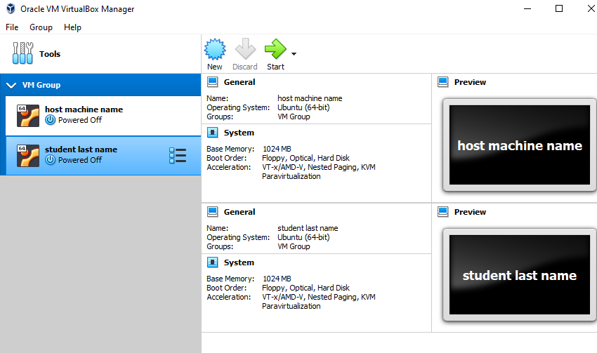

## Part 1

Most popular hypervisors:
```
VMware ESXi/vSphere
Microsoft Hyper-V
Oracle VirtualBox
Citrix XenServer
```

Differences between them:

```
Microsoft Hyper-V - key advantages of Hyper-V is that it can be integrated into a Windows Server package.

Citrix XenServer - ties into other Citrix products such as XenDesktop, which covers virtual desktop delivery, and XenApp, which does the same for apps

Oracle - one step further than its competitors in pursuing an open source policy, Oracle has made its VirtualBox software freely available,
         VirtualBox is also notable for running on a wide number of operating systems

VMware ESXi/vSphere - suite features an exhaustive array of features for optimising network services, storage and automation,
                      security program vShield that can be tested for free
```

## Part 2


Downloaded and instlled VM1 and VM2 with Ubuntu Desktop, Cloned, Group created




