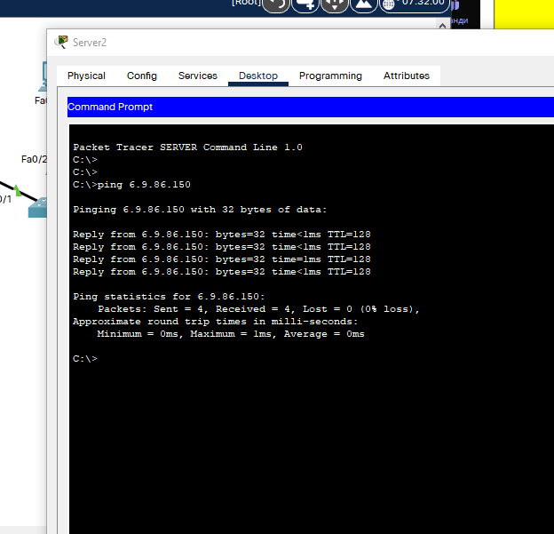
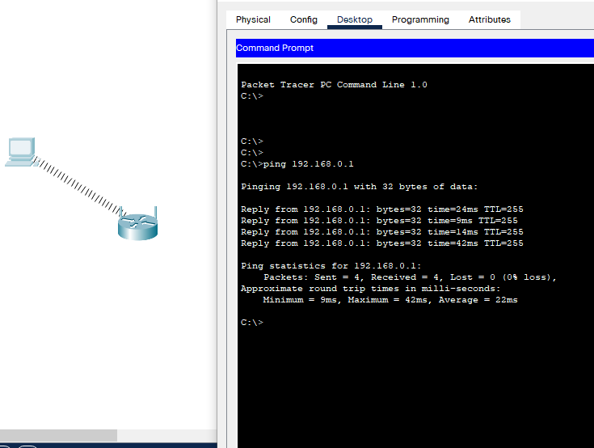
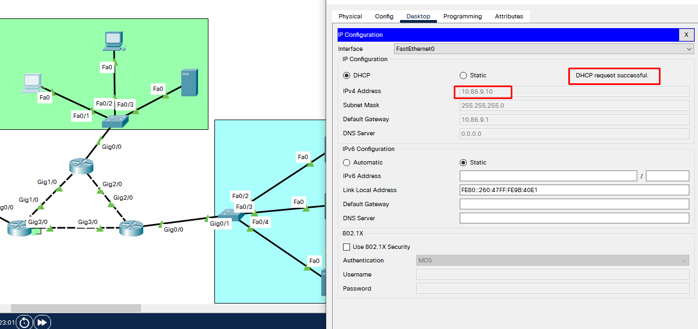

When we added the mask 255.255.255.192, the servers ended up on different networks,
so the packets do not go directly through the switch, but through the router 

After we added Different VLANs to the switch, servers stoped seeing each other
because now they are on a different VLANs

