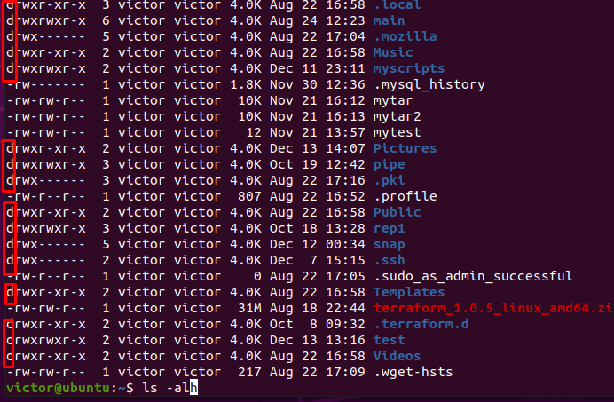
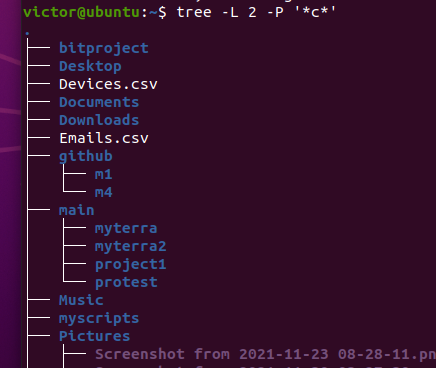
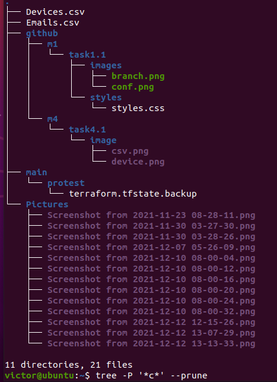
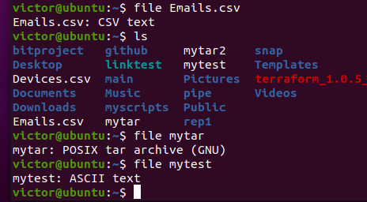

## Task 1

### Part 1

login as root:
```
sudo su
```
```
passwd victor
etc/passwd
etc/shadow
```
Following commands can be used to determine registered
users and history/log of excuted commands:
```
passwd -a -S
w
history
auditd , ac -p -d lascomm
```

To change personal info:
```
usermod -l victor victor2
chfn victor
```
Checked manual on the following commands:
```
man w
man acct
info passwd 

w -i -s  to use the short format and display ip address
ac -p -d  Print totals for each day for each user

man finger
```
Checking list of directories with ls:
```
ls -alh


```
### Part 2

I used the following commands:
```
tree -L -P '*c*'
tree -P '*.png' --prune
```




Checking the file type with the following command:

```
file
```



To move directly to home directory used:
```
cd
cd ~

Absolute:
cd /home/victor
```
Checking ls with several options:
```
ls -a -l -h
ls github -R

