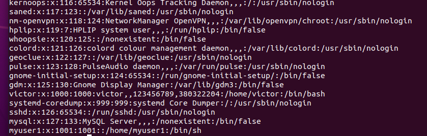
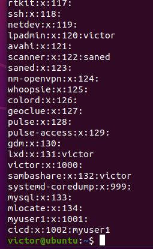
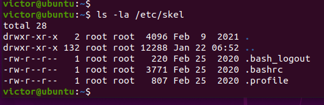

1. Structure etc/passwd and etc/group:

```
victor:x:1000:1000:victor,,123456789,380322204:/home/victor:/bin/bash

victor - username
x - password
1000 - user ID
1000 - group ID
123456789,380322204 - user info
/home/victor - user home directory
/bin/bash - command line 

victor:x:1000:

victor - group name
x - group password 
1000 - group id
also there can be group members field with the list of user that are in this group

```


Pseudo users:

```
pseudo users are pre-defined users such as 'mail', 'uucp, 'nobody', etc...).

tss:x:106:111:TPM software stack,,,:/var/lib/tpm:/bin/false
uuidd:x:107:114::/run/uuidd:/usr/sbin/nologin
tcpdump:x:108:115::/nonexistent:/usr/sbin/nologin
avahi-autoipd:x:109:116:Avahi autoip daemon,,,:/var/lib/avahi-autoipd:/usr/sbin/nologin
usbmux:x:110:46:usbmux daemon,,,:/var/lib/usbmux:/usr/sbin/nologin
```
2. User ID, range
3. GID, range

```
A UID (user identifier) is a number assigned by Linux to each user on the system. 
This number is used to identify the user to the system and to determine which system resources the user can access.

root user has the UID of 0
Most Linux distributions reserve the first 100 UIDs for system use. New users are assigned UIDs starting from 500 or 1000

Groups in Linux are defined by GIDs (group IDs)
first 100 GIDs are usually reserved for system use
The GID of 0 corresponds to the root group and the GID of 100 usually represents the users group
```



4. Determine user belongings:
```
groups <username>
```

5. Commands and parameters for adding users to the system:
```
useradd [OPTIONS] USERNAME
useradd -m username  (option to create the user home)
useradd -m -d /opt/username username   (useradd -m -d /opt/username username)
useradd -u 1234 username (specific uid)

Also too be able to log in as the newly created user, you need to set the user password.
To do that run the "passwd" command followed by the username
```
6. Change username:
```
sudo usermod -l newname oldname 
```
7. Skel Dir:
```
/etc/skel - is derived from the skeleton because it contains basic structure of home directory
The /etc/skel directory contains files and directories that are automatically copied over to a new user’s when it is created from useradd command.
```



8. Remove User:
```
sudo userdel -r username
```

9. What commands and keys should be used to lock and unlock a user account:
```
sudo usermod -l username
sudo usermod -u username
```


