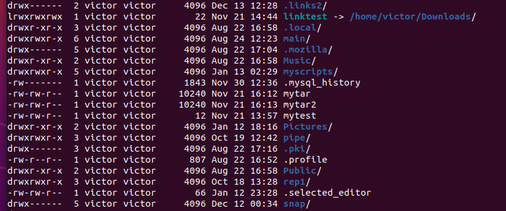
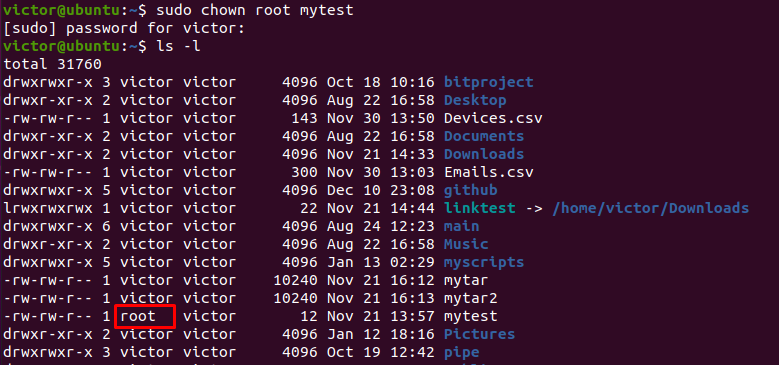
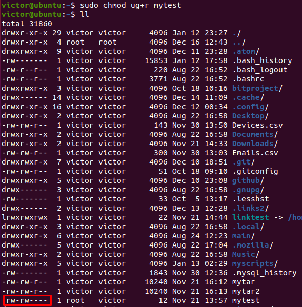
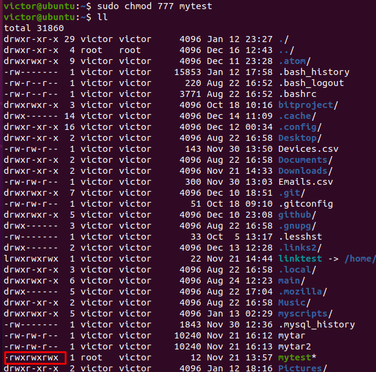
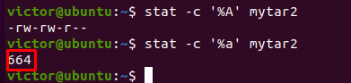
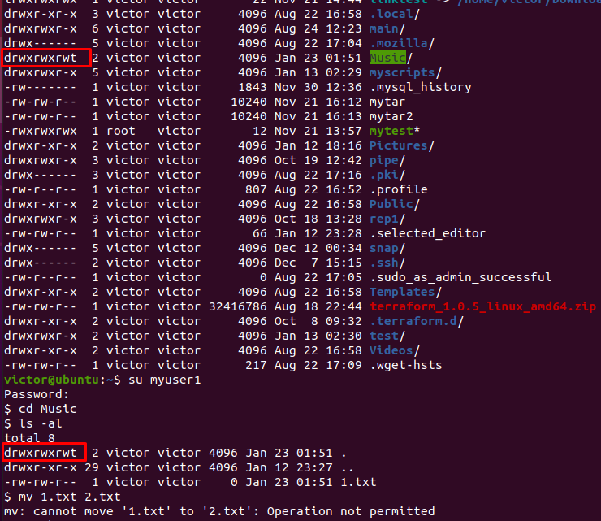

1. Structure etc/passwd and etc/group:

```
victor:x:1000:1000:victor,,123456789,380322204:/home/victor:/bin/bash

victor - username
x - password
1000 - user ID
1000 - group ID
123456789,380322204 - user info
/home/victor - user home directory
/bin/bash - command line 

victor:x:1000:

victor - group name
x - group password 
1000 - group id
also there can be group members field with the list of user that are in this group

```


Pseudo users:

```
pseudo users are pre-defined users such as 'mail', 'uucp, 'nobody', etc...).

tss:x:106:111:TPM software stack,,,:/var/lib/tpm:/bin/false
uuidd:x:107:114::/run/uuidd:/usr/sbin/nologin
tcpdump:x:108:115::/nonexistent:/usr/sbin/nologin
avahi-autoipd:x:109:116:Avahi autoip daemon,,,:/var/lib/avahi-autoipd:/usr/sbin/nologin
usbmux:x:110:46:usbmux daemon,,,:/var/lib/usbmux:/usr/sbin/nologin
```
2. User ID, range
3. GID, range

```
A UID (user identifier) is a number assigned by Linux to each user on the system. 
This number is used to identify the user to the system and to determine which system resources the user can access.

root user has the UID of 0
Most Linux distributions reserve the first 100 UIDs for system use. New users are assigned UIDs starting from 500 or 1000

Groups in Linux are defined by GIDs (group IDs)
first 100 GIDs are usually reserved for system use
The GID of 0 corresponds to the root group and the GID of 100 usually represents the users group
```


4. Determine user belongings:
```
groups <username>
```

5. Commands and parameters for adding users to the system:
```
useradd [OPTIONS] USERNAME
useradd -m username  (option to create the user home)
useradd -m -d /opt/username username   (useradd -m -d /opt/username username)
useradd -u 1234 username (specific uid)

Also too be able to log in as the newly created user, you need to set the user password.
To do that run the "passwd" command followed by the username
```
6. Change username:
```
sudo usermod -l newname oldname 
```
7. Skel Dir:
```
/etc/skel - is derived from the skeleton because it contains basic structure of home directory
The /etc/skel directory contains files and directories that are automatically copied over to a new user’s when it is created from useradd command.
```


8. Remove User:
```
sudo userdel -r username
```

9. What commands and keys should be used to lock and unlock a user account:
```
sudo passwd -l username
sudo passwd -u username
```

10. How to remove a user's password and provide him with a password-free login for subsequent password change.
```
open the sudoers configuration file with sudo visudo, and add the following line to the file:

username ALL=(ALL) NOPASSWD:ALL
Close the editor to apply the changes, and test the effect on sudo in a new terminal.

Delete the password for your user by running this command:

sudo passwd -d `whoami`
```
11. Display the extended format of information about the directory, tell about the information columns displayed on the terminal:
```
ls -la or ll

shows owners, groups, all - permissions
link count
onwer name
group name
size
date and time
name
```



12. Briefly describe the acronym for access rights.
```
Permissions are grouped by the following letter or digits:
"r" - read - 4
"w" - write - 2
"x" - execute - 1
"-" - no permission - 0
Permissions can be set and combined in multiple ways for owner, group and all:
rwx with value 7 - read write and execute combined
rw- with value 6
r-- with value 4
--x with value 1
--- with value 0

can be set with "chmod" command

```
13. Sequence of defining the relationship between the file and the user.
```
After file is created, current user is set as owner, and file added to the users group
```

14. What commands are used to change the owner of a file (directory), as well as the mode of
access to the file? Give examples, demonstrate on the terminal.
```
chown and chmod
```






15. What is an example of octal representation of access rights? Describe the umask
command.
```
read - 4
write - 2
execute - 1
no permission - 0

stat -c '%a' filename  (to view access in octal)

The user file creation mode mask (umask) is use to determine the file permission for newly created files
Octal value : Permission
0 : read, write and execute
1 : read and write
2 : read and execute
3 : read only
4 : write and execute
5 : write only
6 : execute only
7 : no permissions
```


16. Give definitions of sticky bits and mechanism of identifier substitution. Give an example of
files and directories with these attributes.
```
This permission does not affect individual files. However, at the directory level, it restricts file deletion. 
Only the owner (and root) of a file can remove the file within that directory. A common example of this is the /tmp directory

to add and remove sticky bits
chmod +t
chmod -t
```


17. What file attributes should be present in the command script?
```
Some Linux-native filesystems support several attributes that you can adjust with the chattr command. The files and directories can have following attributes:
a - append only
c - compressed
d - no dump
e - extent format
i - immutable
j - data journaling
s - secure deletion
t - no tail-merging
u - undeletable
A - no atime updates
D - synchronous directory updates
S - synchronous updates
T - top of directory hierarchy
```
