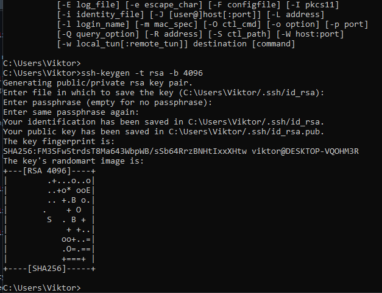

## Part 1

1. How many states could has a process in Linux?
```
5 Possible states:

Running or Runnable (R)
Uninterruptible Sleep (D)
Interruptable Sleep (S)
Stopped (T)
Zombie (Z)
```


2. Examine the pstree command. Make output (highlight) the chain (ancestors) of the current process.
```
pstree is a Linux command that shows the running processes as a tree. It is used as a more visual alternative to the ps command.
```

 
3. What is a proc file system?
```
Proc file system (procfs) is virtual file system created on fly when system boots,
contains useful information about the processes that are currently running
ls -l /proc
```
4. Print information about the processor (its type, supported technologies, etc.).
```
lscpu
cat /proc/cpuinfo
```


5. Use the ps command to get information about the process. The information should be as follows: the owner of the process, 
the arguments with which the process was launched for execution, the group owner of this process, etc.
```
 ps -eo user,comm,pid,group,gid
```


6. How to define kernel processes and user processes?
```
ps -u username  (check processes for the specific users)
ps -ef | grep kthreadd (kernel process thread with PID 2)
pstree 2
```


7. Print the list of processes to the terminal. Briefly describe the statuses of the processes. 
 What condition are they in, or can they be arriving in?
```
Almost all processes currently are in state Sleep
ps -aux
top
```


8. Display only the processes of a specific user.
```
ps -u username
```


9. What utilities can be used to analyze existing running tasks (by analyzing the help for the ps command)?
```
top
htop
pstree
grep
awk
```
10. What information does top command display?
```
The top program provides a dynamic real-time view of a running system. 
It can display system summary information as well as a list of processes
```
11. Display the processes of the specific user using the top command
```
top -u victor
```


12. What interactive commands can be used to control the top command? Give a couple of examples.
```
k  :Kill-a-task
You will be prompted for a PID and then the signal to send.
u | U  :Show-Specific-User-Only
You  will be prompted for the uid or name of the user to display.
V  :Forest-View-Mode toggle
In this mode, processes are reordered according to their parents
i  :Idle-Process toggle
Displays all tasks or just active tasks.
```

13. Sort the contents of the processes window using various parameters (for example, the amount of processor time taken up, etc.)
```
he can sort interactively using command "htop" and clicking on the column
```


14. Concept of priority, what commands are used to set priority?
```
The current priority of a process can be displayed using ps command.
The “NI” column in the ps command output indicates the current nice value (i.e priority) of a process.

renice -n -19 -p 3534
```
15. Can I change the priority of a process using the top command? If so, how?
```
Press r. Give PID value of the process you want to change the process value. 
Give renice value (from -20 to +19)
```
16. Examine the kill command. How to send with the kill command process control signal? Give an example of commonly used signals.
```
kill command in Linux (located in /bin/kill), is a built-in command which is used to terminate processes manually.
kill -l :To display all the available signals you can use
kill pid (to kill process using pid)
 
The most commonly used signals are:

1 (HUP) - Reload a process.
9 (KILL) - Kill a process.
15 (TERM) - Gracefully stop a process.

kill -1 37287
```


17. Commands jobs, fg, bg, nohup. What are they for? Use the sleep, yes command to demonstrate the process control mechanism with fg, bg.
```
jobs, fg, bg, - job controlling tools. 
fg - moves command to foreground from background
bg - runs stoped jobs

& sign keeps the job running on the backgroud
sleep 100 &

nohup used to keep the job running even id terminal is closed
nohup ping 127.0.0.1 &
```


## Part 2

1.Check the implementability of the most frequently used OPENSSH commands in the MS Windows operating system. 
(Description of the expected result of the commands + screenshots: command – result should be presented)
```
ssh username@host  (ssh victor@192.168.217.128)
ssh username@host -p port
ssh root@192.168.1.92 -i "C:\Users\username\.ssh\id_rsa"
ssh-keygen -t rsa -b 4096
```




2. Implement basic SSH settings to increase the security of the client-server connection.
```
Strong Usernames and Passwords.
Configure Idle Timeout Interval.
Disable Passwords.
Limit Users' SSH Access.
Only Use SSH Protocol 2. 
Allow Only Specific Clients. 
Enable Two-Factor Authentication. 
Use Public/Private Keys for Authentication with rsa -b 4096 or ed25519
```


3. List the options for choosing keys for encryption in SSH. Implement 3 of them.
```
ssh-keygen -t rsa -b 4096
ssh-keygen -t dsa 
ssh-keygen -t ecdsa -b 521 
ssh-keygen -t ed25519
```


4. Implement port forwarding for the SSH client from the host machine to the guest Linux virtual machine behind NAT.
```

```


