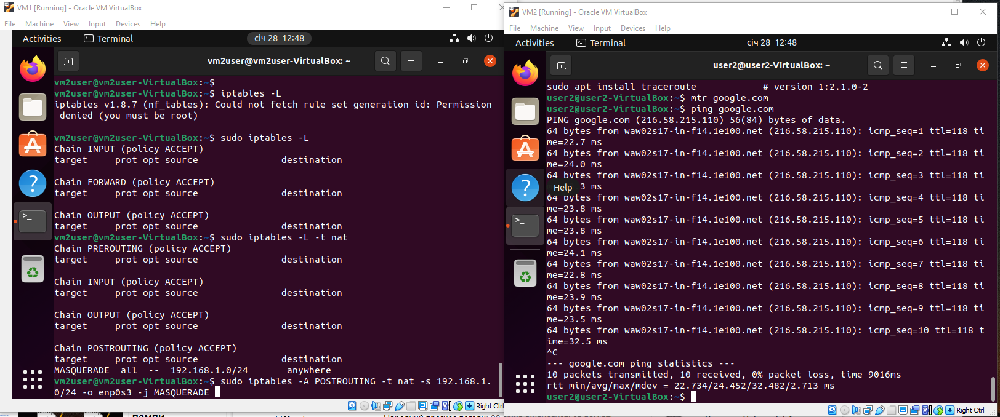
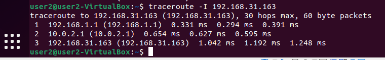
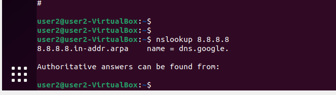
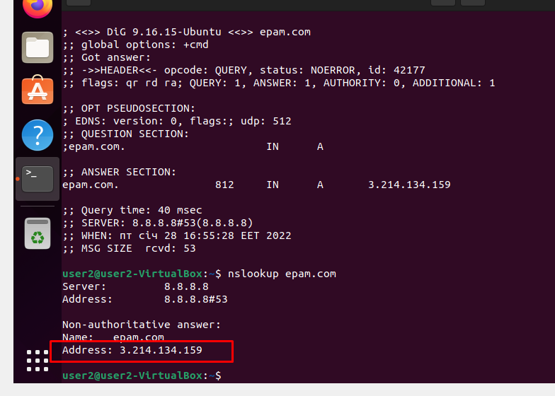
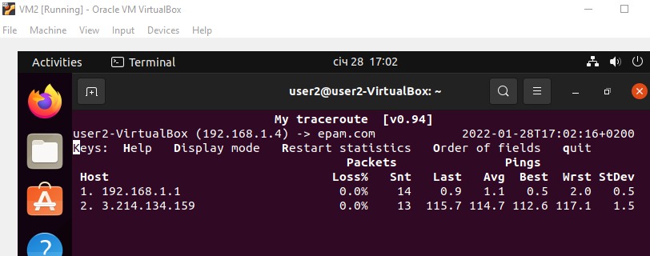
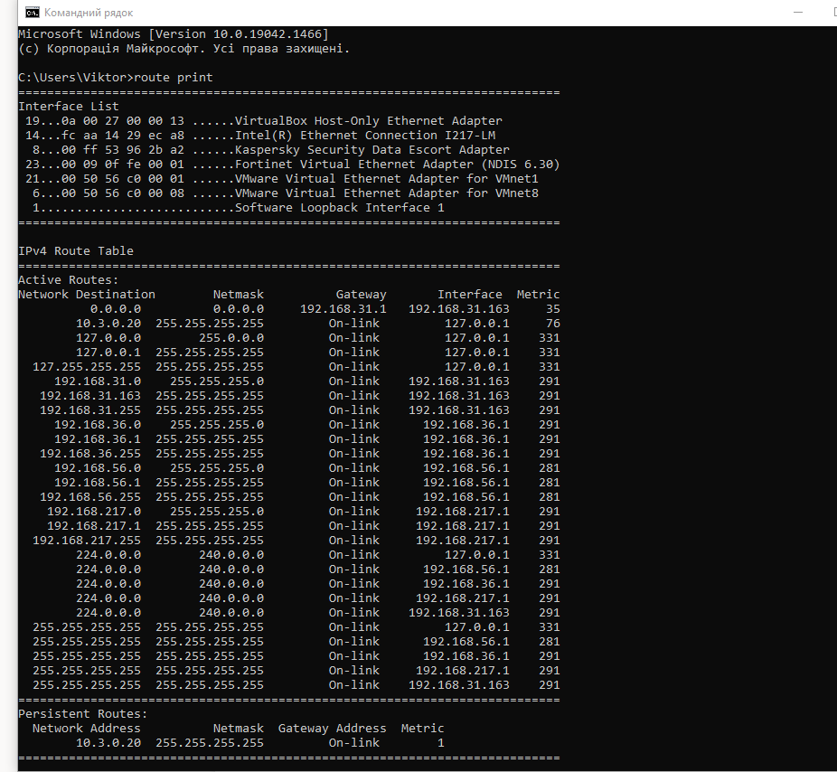
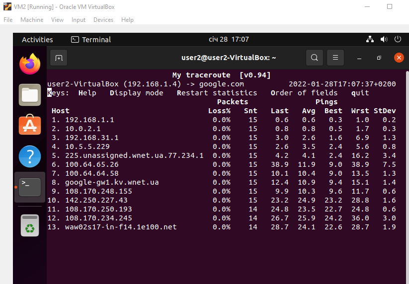

Configure network devices on VM1, VM2
```
sudo ip addr add 192.168.1.4/24 dev enp0s3  on VM2
sudo ip addr add 192.168.1.1/24 dev enp0s8  on VM1
ip link set dev enp0s3 up  on VM2
ip link set dev enp0s8 up  on VM1

sudo route add default gw 192.168.1.1 enp0s3  on VM2

nameserver 8.8.8.8 added to /etc/resolv.conf  on VM2
```
Enable forwarding on VM1
```
sudo nano /etc/sysctl.conf 
net.ipv4.ip_forward = 1
sysctl -p  to make changes take effect

sudo ip tables -t nat -A PREROUTING
 iptables -t nat -A POSTROUTING -t nat -s 192.168.1.0/24 -o enp0s3 -j MASQUERADE

```

 

  
















 

