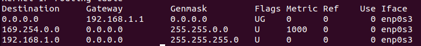
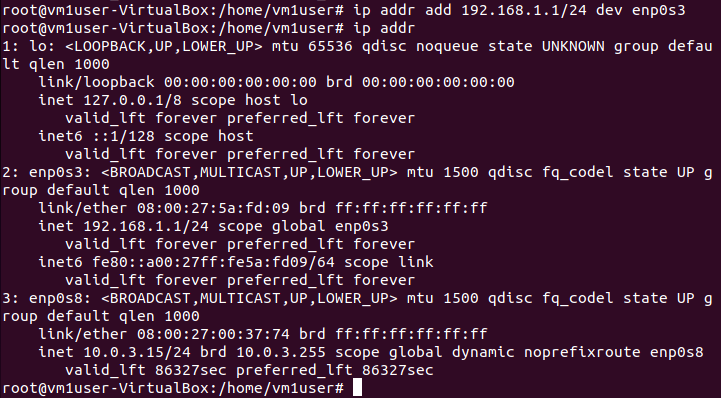
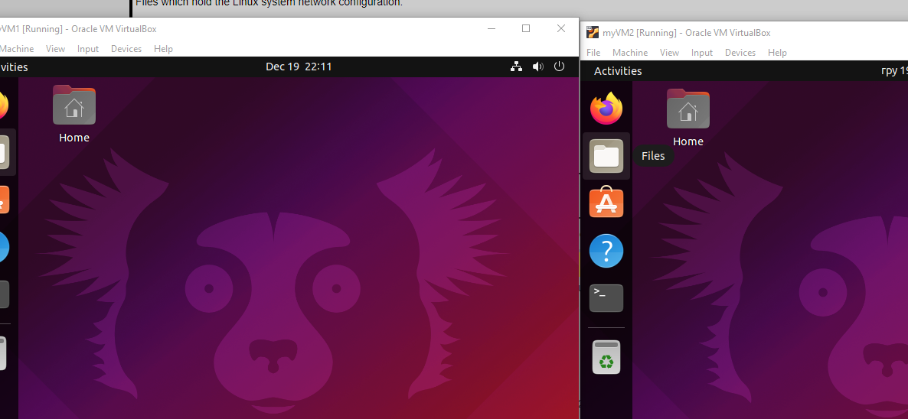
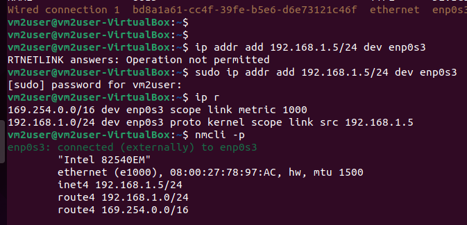

Configure network devices on VM1, VM2
```
sudo ip addr add 192.168.1.4/24 dev enp0s3
sudo ip addr add 192.168.1.1/24 dev enp0s8
ip link set dev enp0s3 up
ip link set dev enp0s8 up

sudo route add default gw 192.168.1.1 enp0s3

nameserver 8.8.8.8 added to /etc/resolv.conf on VM2
```
Enable forwarding on VM1
```
sudo nano /etc/sysctl.conf 
net.ipv4.ip_forward = 1
sysctl -p  to make changes take effect

sudo ip tables -t nat -A PREROUTING
sudo ip tables -t 

```

 

  





 
 iptables -t nat -A PREROUTING -p tcp –dport 80 -j DNAT –to-destination 122.164.34.240. 
 iptables -t nat -A POSTROUTING -p tcp -d 122.164.34.240 –dport 80 -j MASQUERADE
