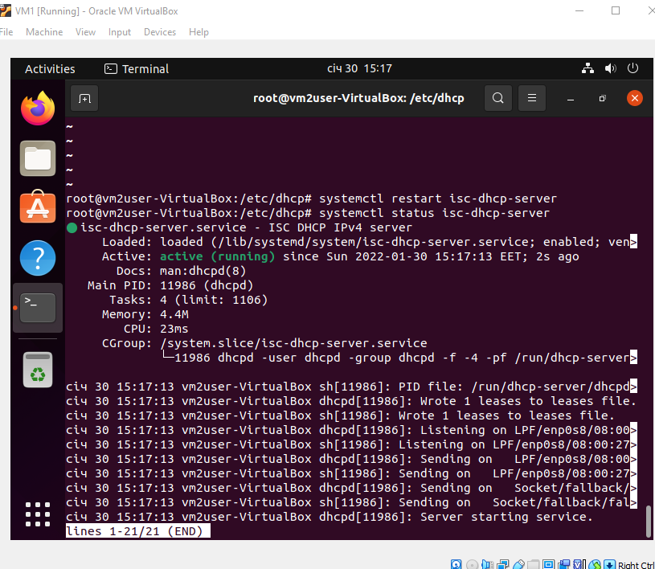
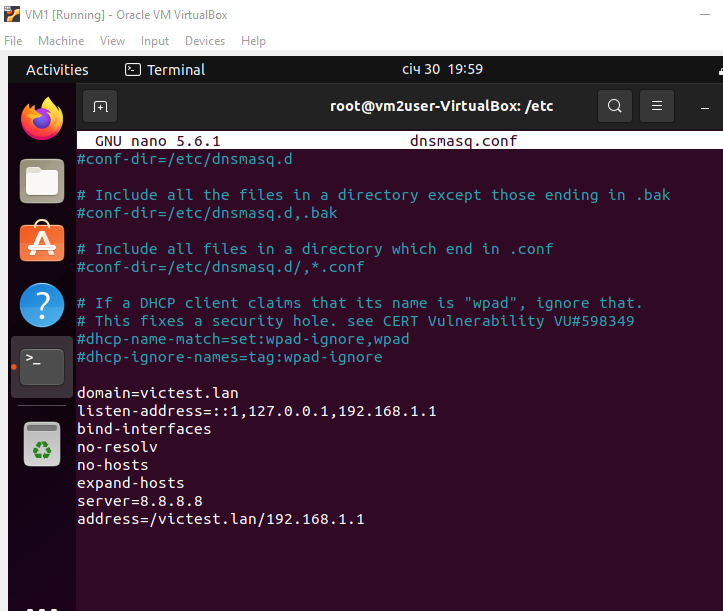

Lets install and configure VM3


Install and configure dhcp server
```
sudo apt-get install isc-dhcp-server
nano /etc/dhcp/dhcpd.conf
nano /etc/default/isc-dhcp-server

default-lease-time 7200;
max-lease-time 43200;

subnet 192.168.1.0 netmask 255.255.255.0 {

range 192.168.1.2 192.168.1.100;

option routers 192.168.1.1;

option domain-name-servers 192.168.1.1;
}

service isc-dhcp-server start
```

Set static IP for VM1
```
network:
  version: 2
  renderer: NetworkManager
  ethernets:
    enp0s3:
     dhcp4: no
     addresses: [192.168.1.1/24]
     nameservers:
       addresses: [8.8.8.8,8.8.4.4]
       
sudo systemctl restart NetworkManager
```







