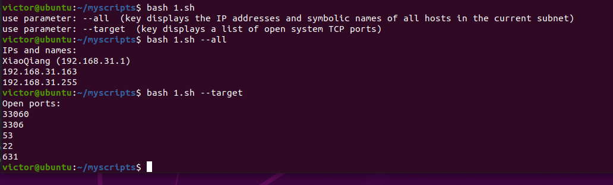
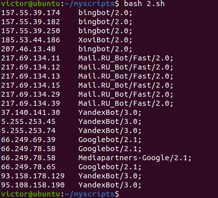
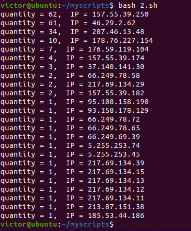
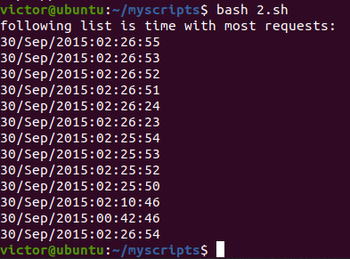
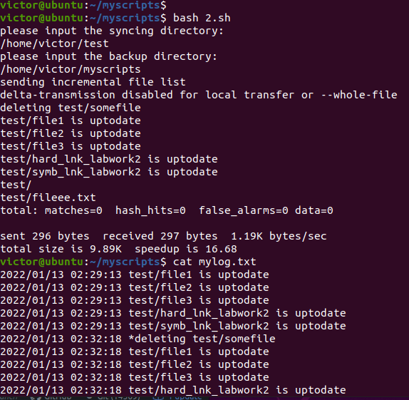

 ### Part 1
 
 Create a script with a separate functions that uses the following keys:
 
 "without parameters", --all key, --target key


```
#!/usr/bin/env bash

myfunc(){
  if [[ "$1" != "--all" && "$1" != "--target" ]];
  then
    echo "use parameter: --all  (key displays the IP addresses and symbolic names of all hosts in the current subnet)"
    echo "use parameter: --target  (key displays a list of open system TCP ports)"
  elif [ "$1" == "--all" ];
  then
    echo "please enter local subnet address: "
    read x
    allip $x
  else
    allports
  fi
}
```
The --all key displays the IP addresses and symbolic names of all hosts in the current subnet:
```
allip(){
  printf "IPs and names: \n`nmap -sn $x/24 | awk '/report/{print $5,$6}'`\n"
}
```
The --target key displays a list of open system TCP ports:
```
allports(){
  printf "Open ports: \n`netstat -tuna | awk -F: '/tcp/{print $2}' | awk '{print $1}'`\n"
}

myfunc $1
```

And check the results:





 ### Part 2
 
 1. Script for: From which ip were the most requests?
```
cat apache_logs.txt | awk '{print $1}' | sort | uniq -c | sort -nr | head -1 | awk '{print $2}'
```
2. What is the most requested page?
```
cat apache_logs.txt | awk '{print $7}' | sort | uniq -c | sort -nr | head -1 | awk '{print $2}'
```
3. How many requests were there from each ip?
```
cat apache_logs.txt | awk '{print $1}' | sort | uniq -c | sort -nr | awk '{print "quantity = "$1 ",  IP = "$2}'
```
4. What non-existent pages were clients referred to?
```
cat apache_logs.txt | awk '/error/{print $7}'
```
5. What time did site get the most requests?
```
echo "following list is the time with most requests: "
cat apache_logs.txt | awk '{print $4}' | sort | uniq -c | sort -nr | head -13 | awk -F[ '{print $2}'
```
6. What search bots have accessed the site? (UA + IP)
```
cat apache_logs.txt | grep 'bot' | awk '{print $1 "\t " $(NF-1)}' | sort | uniq
```
Results:







## Part 3

Create a data backup script that takes the following data as parameters:
1. Path to the syncing directory.
2. The path to the directory where the copies of the files will be stored.

```
myfunc(){
  echo "please input the syncing directory: "
   read x
  echo "please input the backup directory: "
    read y
   rsync -avh --delete $x $y --log-file=my.txt
   sed '/sent\|building\|delta-transmission\|total:\|total size/d' ./my.txt | awk '{print $1,$2,$4,$5,$6}' > mylog.txt

#   echo "`date +%Y.%m.%d.%H.%M`" >> mylog.txt
 }

myfunc
```

