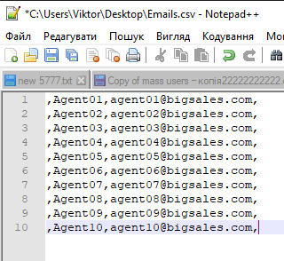
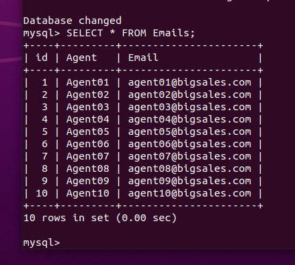
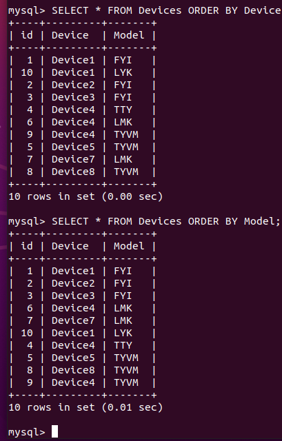

# Database administration
### Part 1 

Installed and configured MySQL Server on Ubuntu VM. 

```sh
  sudo apt install mysql-server

  sudo mysql -u root 

  show databases;

  create database Sales;
  
  use Sales;
  
  CREATE USER 'victor'@'localhost' IDENTIFIED BY 'NewTestPassw0rd!';
  
  GRANT ALL PRIVILEGES ON *.* TO 'victor'@'localhost';
  
  flush privileges;
  
  exit;
  
  mysql -u victor -p
```

Created and filled in tables from csv by using mysqlimport.

```sh

CREATE TABLE Emails (
            id INT NOT NULL AUTO_INCREMENT,
            Agent VARCHAR(150) NOT NULL,
            Email VARCHAR(150) NOT NULL,           
            PRIMARY KEY (id)
);
CREATE TABLE Devices (
            id INT NOT NULL AUTO_INCREMENT,
            Device VARCHAR(150) NOT NULL,
            Model VARCHAR(150) NOT NULL,           
            PRIMARY KEY (id)
);
CREATE TABLE Address (
            id INT NOT NULL AUTO_INCREMENT,
            City VARCHAR(150) NOT NULL,
            Country VARCHAR(150) NOT NULL,           
            PRIMARY KEY (id)
);

sudo mysqlimport --fields-terminated-by=, \
            --local -u root \
             Sales \
             Emails.csv
sudo mysqlimport --fields-terminated-by=, \
            --local -u root \
             Sales \
             Devices.csv
sudo mysqlimport --fields-terminated-by=, \
            --local -u root \
             Sales \
             Address.csv
```





Execute different SQL queries

```
SELECT * FROM Emails;
SELECT * FROM Address;
SELECT * FROM Devices WHERE Device='Device4';
SELECT * FROM Emails GROUP BY id;
SELECT * FROM Devices ORDER BY Device;
TRUNCATE TABLE Emails;
```



Create new users and check privilegies
```
CREATE USER 'agent1'@'localhost' IDENTIFIED BY 'passwd1';
CREATE USER 'agent2'@'localhost' IDENTIFIED BY 'passwd2';
CREATE USER 'agent3'@'localhost' IDENTIFIED BY 'passwd3';
CREATE USER 'agent4'@'localhost' IDENTIFIED BY 'passwd4';

GRANT SELECT,DELETE ON Sales.* TO 'agent1'@'localhost';
GRANT DROP ON Sales.* TO 'agent2'@'localhost';
GRANT ALTER,INSERT ON Sales.* TO 'agent3'@'localhost';
GRANT CREATE ON Sales.* TO 'agent4'@'localhost' WITH GRANT OPTION;

SHOW GRANTS FOR 'agent3'@'localhost';

Populated table rows with data using INSERT. The result is as follows:


I used a mock database of MikroTik routers that I manage, listing device models, services, users, etc.

Performed several queries as per task:


Added users with different permissions:
```

```sh
mysql> CREATE USER user1@localhost IDENTIFIED BY passwd1;
mysql> GRANT SELECT on *.* to user1@localhost;
mysql> CREATE USER user2@localhost IDENTIFIED BY passwd2;
mysql> GRANT SELECT, CREATE, DELETE on *.* to user2@localhost;
```

Testing permissions:


Querying 'db' table of 'mysql' database:


### Part 2

Making backup, deleting a table, and restoring it:

```sh
mysqldump --databases networking > dump1.sql
mysql
USE networking
DROP services;
SHOW tables;
source dump1.sql
SHOW tables;
```

Creating an RDS DB:


Connecting to it, restoring data from dump, making a selection:

```sh
mysql -h database-2.cwjrdnvot6lh.eu-central-1.rds.amazonaws.com -P 3306 -u dbadmin -p
use networking
source dump1.sql
SHOW tables;
SELECT device.id, device.ddns, device.status, users.device_id, COUNT(users.user) FROM device, users WHERE device.id = users.device_id GROUP BY users.device_id ORDER BY device.id;
mysqldump --databases networking > dump2.sql
```

### Part 3 - Amazon DynamoDB

Created DynamoDB table:


Used Scan and Query:


